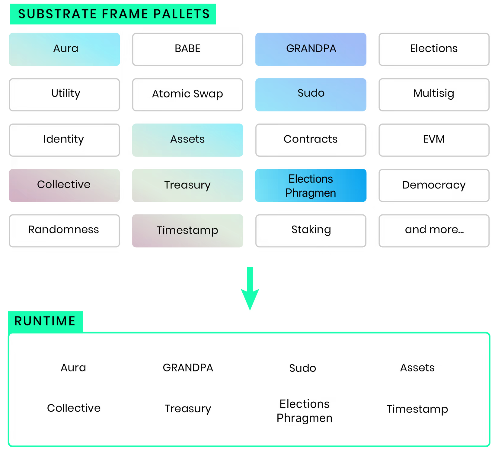

# Proof of Existence Pallet

This tutorial illustrates how to create a custom pallet for a Substrate
runtime using **macros** that are part of the [FRAME](/reference/frame-macros/) development environment.

For this tutorial, you'll build a simple **proof-of-existence** application. Proof-of-existence is an approach to validating the authenticity and ownership of a digital object by storing information about the object on the blockchain.
Because the blockchain associates a timestamp and account with the object, the blockchain record can be used to "prove" that a particular object existed at a specific date and time.
It can also verify who the owner of a record was at that date and time.

## Digital objects and hashes

Instead of storing an entire file on the blockchain, it can be much more efficient to simply store a [cryptographic hash](https://en.wikipedia.org/wiki/Cryptographic_hash_function) of that file.
This is also known as a "digital fingerprint".
The hash enables the blockchain to store files of arbitrary size efficiently by using a small and unique hash value.
Because any change to a file would result in a different hash, users can prove the validity of a file by computing the hash and comparing that hash with the hash stored on chain.


## Digital objects and account signatures

Blockchains use [public key cryptography](https://en.wikipedia.org/wiki/Public-key_cryptography) to map digital identities to accounts that have private keys.
The blockchain records the account you use to store the hash for a digital object as part of the transaction.
Because the account information is stored as part of the transaction, the controller of the private key for that account can later prove ownership as the person who initially uploaded the file.

## How much time do you need to complete this tutorial?

This tutorial requires compiling Rust code and takes approximately one to two hours to complete.

## Before you begin

For this tutorial, you download and use working code. Before you begin, verify the following:

- You have configured your environment for Substrate development by installing [Rust and the Rust toolchain](/main-docs/install/).

- You have completed [Build a local blockchain](/tutorials/get-started/build-local-blockchain/) and have the Substrate node template installed locally.

- You have used predefined accounts as described in [Simulate a network](/tutorials/get-started/simulate-network/) to start nodes on a single computer.

- You are generally familiar with software development and use command-line interfaces.

## Tutorial objectives

By completing this tutorial, you will accomplish the following objectives:

- Learn the basic structure of a custom pallet.

- See examples of how Rust macros simplify the code you need to write.

- Start a blockchain node that contains a custom pallet.

- Add front-end code that exposes the proof-of-existence pallet.

## Design the application

The proof-of-existence application exposes the following callable functions:

- `create_claim()` allows a user to claim the existence of a file by uploading a hash.

- `revoke_claim()` allows the current owner of a claim to revoke ownership.

## Build a custom pallet

The Substrate node template has a FRAME-based runtime.
As you learned in [Runtime development](/main-docs/fundamentals/runtime-intro), FRAME is a library of code that allows you to build a Substrate runtime by composing modules called pallets.
You can think of the pallets as individual pieces of logic that define what your blockchain can do.
Substrate provides you with a number of pre-built pallets for use in FRAME-based runtimes.



This tutorial demonstrates how to create your own FRAME pallet to be included in your custom blockchain.

<!-- slide:break -->

# Set up scaffolding for your pallet

This tutorial demonstrates how to create a custom pallet from scratch.
Therefore, the first step is to remove some files and content from the files in the node template directory.

1. Open a terminal shell and navigate to the root directory for the node template.

1. Change to the `pallets/template/src` directory by running the following command:

    ```bash
    cd pallets/template/src
    ```

1. Remove the following files:

    ```bash
    benchmarking.rs
    mock.rs
    tests.rs
    ```

1. Open the `lib.rs` file in a text editor.

    This file contains code that you can use as a template for a new pallet.
    You won't be using the template code in this tutorial.
    However, you can review the template code to see what it provides before you delete it.

1. Delete all of the lines in the `lib.rs` file.

1. Add the macro required to build both the native Rust binary (`std`) and the WebAssembly (`no_std`) binary.

    ```rust
    #![cfg_attr(not(feature = "std"), no_std)]
    ```

    All of the pallets used in a runtime must be set to compile with the `no_std` features.

1. Add a skeleton set of pallet dependencies and [macros](/reference/frame-macros) that the custom pallet requires by copying the following code:

    ```rust
    // Re-export pallet items so that they can be accessed from the crate namespace.
    pub use pallet::*;

    #[frame_support::pallet]
    pub mod pallet {
      use frame_support::pallet_prelude::*;
      use frame_system::pallet_prelude::*;

      #[pallet::pallet]
      #[pallet::generate_store(pub(super) trait Store)]
      pub struct Pallet<T>(_);

      #[pallet::config]  // <-- Step 2. code block will replace this.
      #[pallet::event]   // <-- Step 3. code block will replace this.
      #[pallet::error]   // <-- Step 4. code block will replace this.
      #[pallet::storage] // <-- Step 5. code block will replace this.
      #[pallet::call]    // <-- Step 6. code block will replace this.
    }
    ```

    You now have a framework that includes placeholders for _events_, _errors_, _storage_, and _callable functions_.

1. Save your changes.
