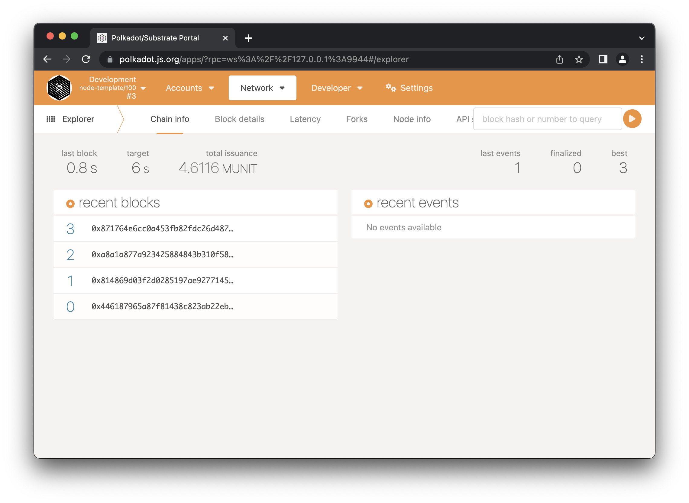
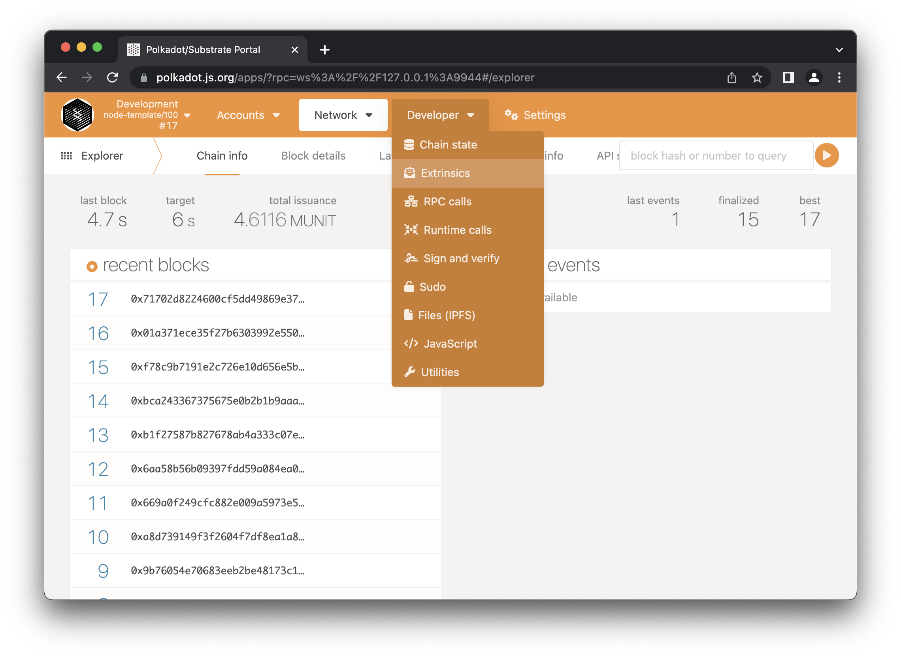
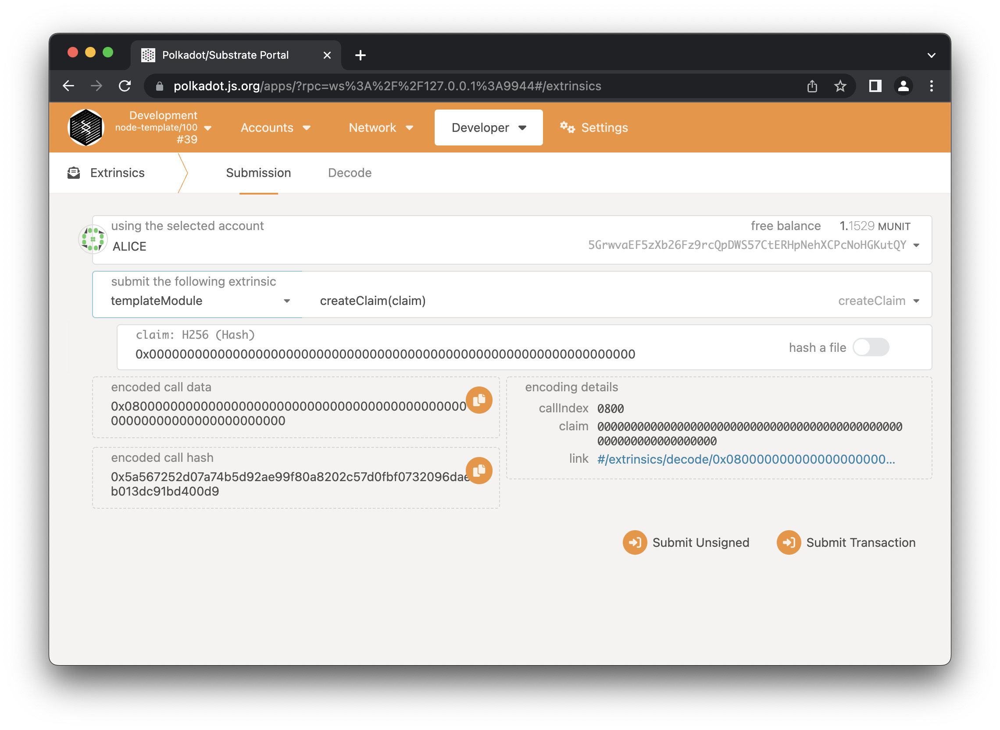
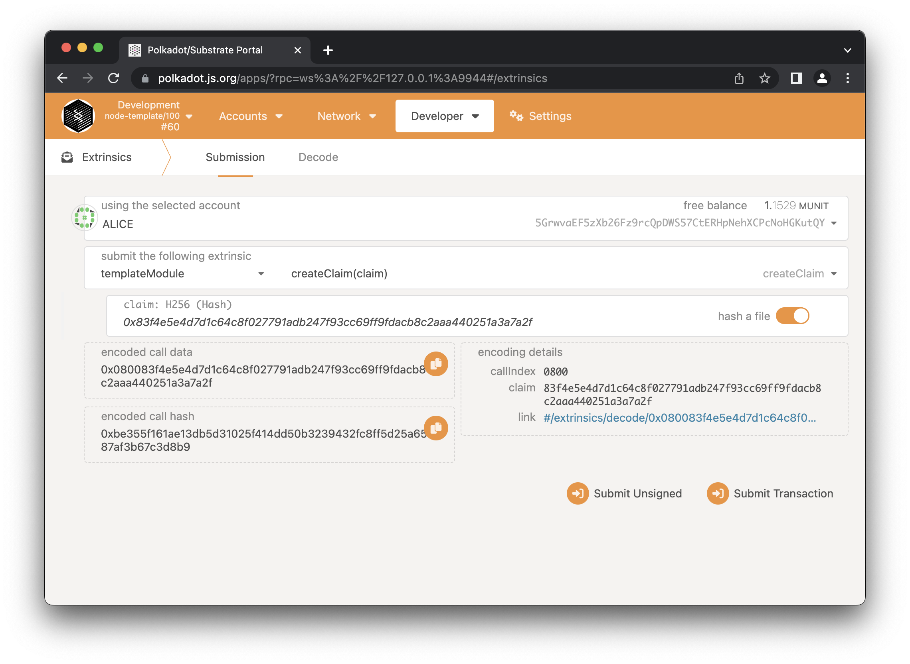
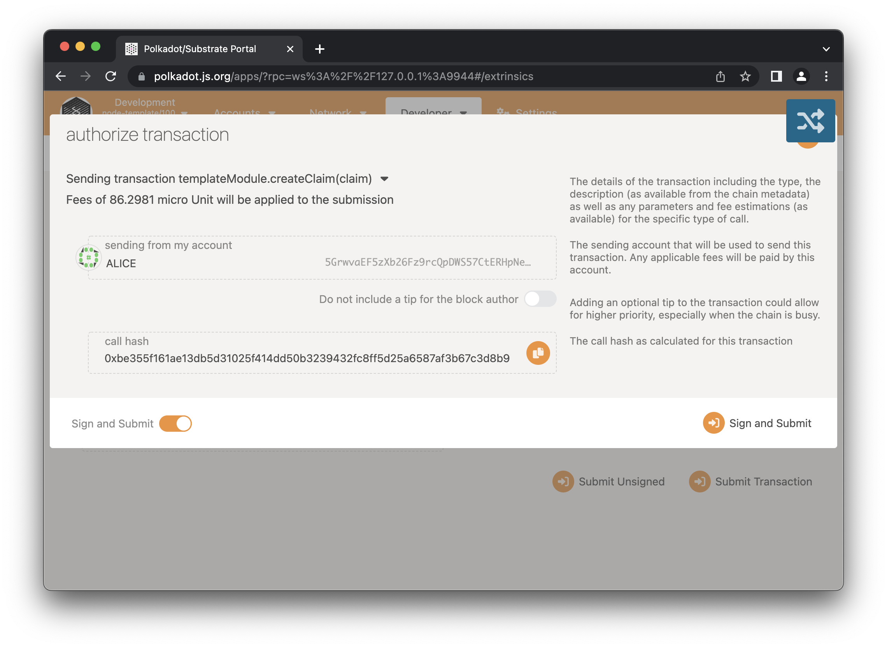
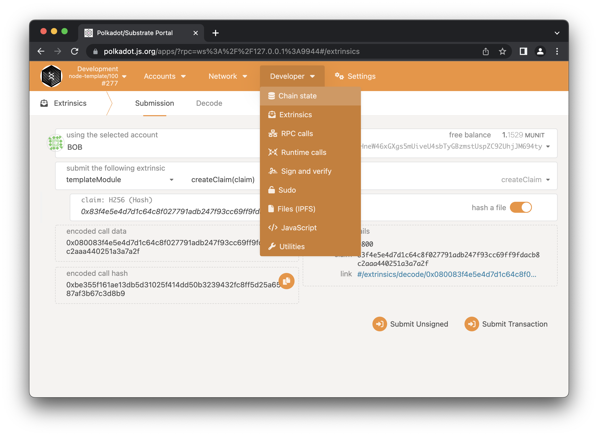
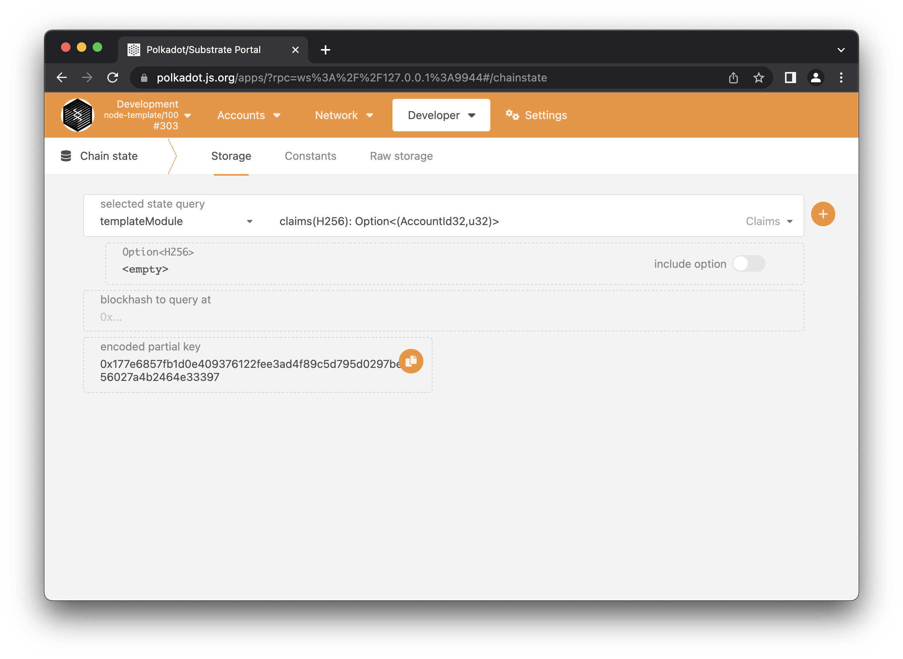
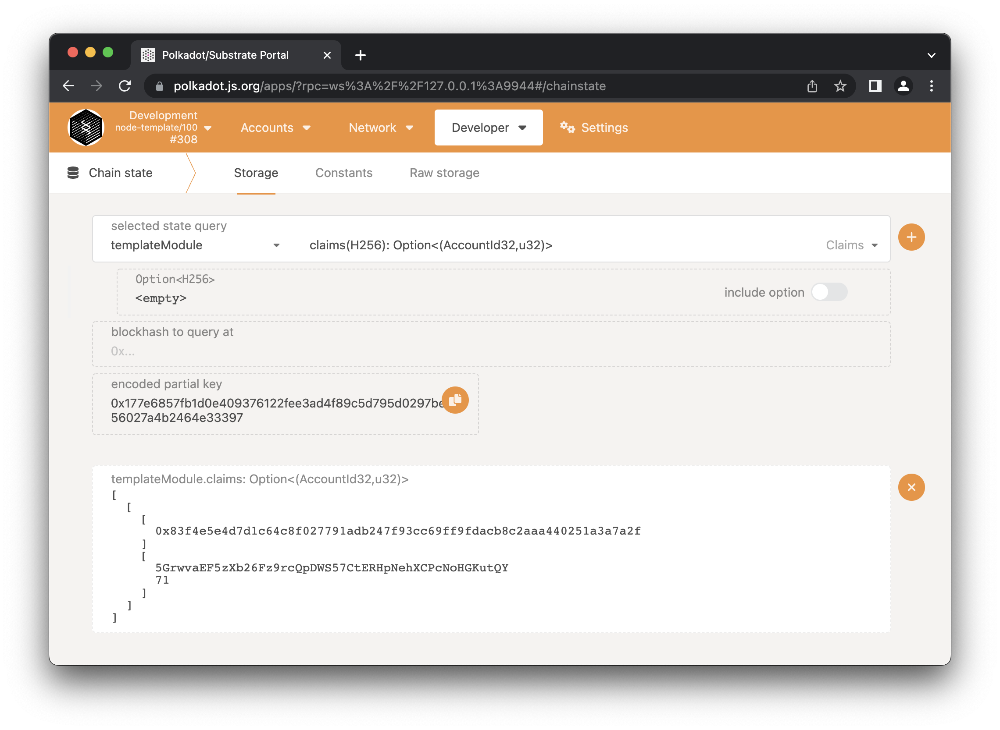

## Interact with your blockchain

Now that you have a new blockchain running with the custom proof-of-existence pallet, we can interact with the chain to make sure all the functionality works as expected!

To do this, we will use Polkadot JS Apps, which is a developer tool that can connect to and interact with any Substrate based blockchain.

By default, your blockchain should be running on `ws://127.0.0.1:9944`, so to connect to it we can use this link:

https://polkadot.js.org/apps/?rpc=ws%3A%2F%2F127.0.0.1%3A9944#/

If your Substrate blockchain is running and Polkadot JS Apps is connected, you should see your block number increase in the top left corner:

### Submit a claim

To test the proof-of-existence pallet using the front-end:

1. Navigate to the ["Developer > Extrinsics"](https://polkadot.js.org/apps/?rpc=ws%3A%2F%2F127.0.0.1%3A9944#/extrinsics) tab.

	

1. Adjust the extrinsics page to select "ALICE" as the account, and "templateModule > createClaim" as the extrinsic.

	

1. Then you can toggle "hash a file", which will allow you to select a file to hash and claim on the blockchain.

	

1. Click "Submit Transaction" in the bottom right corner, then on the pop up click "Sign and Submit".

	

1. If everything was successful, you should see a green extrinsic success notification!

	

### Read a claim

The final step of this tutorial is to check what claims have been stored on your blockchain.

1. Navigate to the ["Developer > Chain State"](https://polkadot.js.org/apps/?rpc=ws%3A%2F%2F127.0.0.1%3A9944#/chainstate) tab.

	

1. Adjust the state query to "templateModule > claims".

1. Toggle off the "include option" on the hash input to leave the input empty.

	This will allow us to see all the claims, rather than just one at a time.

	

1. Press the "+" button to execute the query.

	

	Now you can see that the claim is stored in the blockchain with the data about the owners address and the block number when the claim was made!

<!-- slide:break -->

## Next steps

In this tutorial, you learned the basics of how to create a new custom pallet, including:

- How to add events, errors, storage, and callable functions to a custom pallet.

- How to integrate the custom pallet into the runtime.

- How to compile and start a node that includes your custom pallet.

- How you can use the Polkadot JS Apps developer tool to interact with your custom blockchain.

This tutorial covered the basics without diving too deeply into the code.
However, there's much more you can do as you work toward building your own fully-customized blockchain.
Custom pallets enable you to expose the features you want your blockchain to support.

To complete your understanding of the proof-of-existence chain try:

- Claiming the same file again with "ALICE" or even the "BOB" account.
  - You should get an error!
- Claiming other files with the "ALICE" and/or "BOB" accounts.
- Revoking the claims with the appropriate claim owner account.
- Looking at the final list of claims from reading storage.

To learn more about what's possible by creating custom pallets, explore the
FRAME documentation and the [how-to guides](/reference/how-to-guides).
