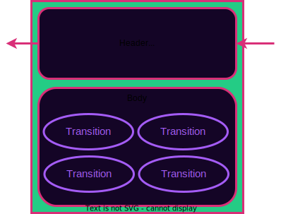

# Blockchain Architecture

We have covered the high level philosophy and innovation behind both Bitcoin and Ethereum.

Let's now look at blockchains in a more technical and architectural way to set up for the exercises we will do later.

## Context: Node

A blockchain node is a single instance of the blockchain software. If you run the Bitcoin client on your computer, you will act as a one of many nodes on the network. The decentralized and permissionless nature of nodes keep blockchain systems resilient to attack.

In these next subsections, we will review architectural concepts which exist within the view of your single node.

### Blocks

In general, you can split up a block into two parts:

- Header: Summary of minimal important information about this block.
- Body: A batched list of state transitions.

The specifics of the header and body can change depending on the blockchain protocol.

The main reason for the separation between these two parts is that it should be possible to use just the headers to verify certain information about the blockchain. A node using just the headers was described originally in the Bitcoin whitepaper, and is known more commonly as a light client.

### Transactions

Transactions are signed messages from users of the blockchain indicating what functions they want to execute.

The most common transaction is a transfer of tokens from the signing user to some recipient address.

The transaction format can differ greatly depending on the details of the blockchain, but a few fields are specifically important:

- Signature: The entire transaction should be signed to identify the sender, and prove they want to execute some message.
- Nonce: A unique number to identify the order of a users transactions and prevent replay attacks on the same chain.
- Chain ID: Some unique identifier for the chain the transaction is intended for. This prevents replay attacks across different forks.
- Payload: Some data which identifies what the transaction is intending to do.

### State Machine

The internals of a blockchain is a simple state machine. It defines:

- The set of valid states
- The rules for transitioning between states.

We can turn a blockchain into a state machine by using the payload in a transaction the state machine transition.

Given some initial "genesis state", we can apply transactions to transition the state from block to block.

It is important to note that the "blockchain" does not contain the state of the chain. This is a common misconception.

The blockchain, as you can see from the definition of the blocks and transactions just contain the information for HOW the state should change.

If you want to construct the blockchain's state, you need to start with some genesis state, and then go block by block and apply the transactions to transition the state. In this way, everyone is able to reconstruct the state of the blockchain on their own.

### Storage

The blockchain state is normally placed in a database on the computer.

## Context: Network

### Peer-to-Peer Network

### Forks

### Consensus
