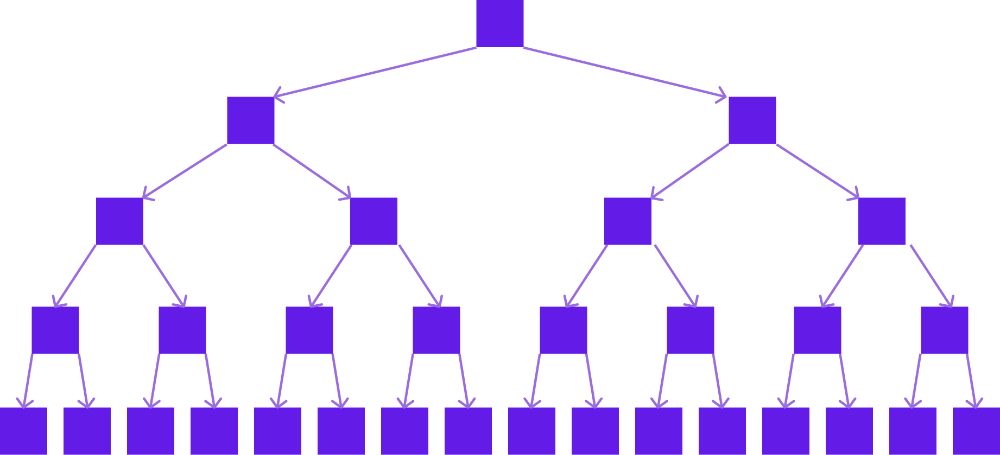

# Hashed Based Data Structures

Using the properties of hash functions, we can construct many different and useful data structures for blockchains.

In many ways, hash based data structures are similar to pointer based data structures like a [linked list](https://en.wikipedia.org/wiki/Linked_list) and a [tree](https://en.wikipedia.org/wiki/Tree_(data_structure)).
In this context, both a pointer and a hash uniquely reference some data in the structure.

Let's take a look at two basic hash based data structures used in blockchain.

## Hash Chains

A hash chain is a linked list using hashes to connect nodes. Each block contains a reference to the previous hash.

This structure is similar to the structure of a linked list, but with a few unique properties.

1. The structure cannot be cyclic.

	Because each node in the hash chain contains the hash of the previous node, and the hash generation is seemingly random, it is not feasible to construct a chain which is cyclic.

1. The structure can only be formed from start to finish.

	You are not able to build new nodes on the hash chain anywhere but the end of the chain. Again, because the nodes are affected by the hash of the previous node, inserting a new node anywhere would completely change the data in all subsequent nodes.

## Merkle Tree

A binary merkle tree is a binary tree using hashes to connect nodes.

To create this structure, you must:

1. collect all the data you want to place in the merkle tree structure
2. find the hash of each piece of data
3. take two hashes, and place them into a new node
4. then repeat this process for the new nodes until there is a single hash

In this structure you can see that each parent node will contain the hashes of its two children, and you can follow that structure down until you get access to the underlying data itself.

While this example is specific for a binary merkle tree, you can use the same process to scale the structure to any number of children nodes per parent.

Merkle trees have a number of unique properties which are very relevant for blockchains.

### Merkle Root Hash

At the end of the merkle trie process, you end up with a single hash that uniquely represents all data in the merkle tree.

This is called the merkle root.

You can use the merkle root to quickly compare that two individuals have exactly the same data and structure without having to share all the data itself.
Due to the properties of hashes, if you and I both have a merkle tree with the same merkle root, we know that we must both have all of the children data which uniquely generate that hash.
This scales to any amount of data since the final merkle root is always the same fixed size.

### Merkle Proofs

Using the merkle tree structure, we are able to identify the existence of a specific piece of data exists in the tree without needing all of the data.

Let's say for example I have a merkle tree which is identifiable by its unique merkle root hash.
In that merkle tree, I want to prove to you there is node with the message "Hello, World!".
The naive approach would be to give you all data which is stored in the tree, where you can plainly see "Hello, World!", and let you calculate the whole structure yourself.
However, since the structure uses recursive hashes, whose output cannot be easily controlled, I can provide the same assurance with just a subset of data.

Instead of giving you all the data, imagine I just give you the data of the nodes leading to the specific data I want to prove exists.
Data which is not relevant to you can be represented just by their hash.
Then, with those hashes, and all the relevant nodes leading to the data you are interested in, you are able to verify that this structure contains that data.

To re-emphasize, this is possible because it is assumed that it would be nearly impossible for me to construct a hash which matches my merkle root while making up data in order to trick you into thinking the tree has some data it does not. The output of a hash is random, and finding some data which would work, especially one that is coherent to my claims, would be impractical.

Merkle proof reduce the amount of data needed to prove the existence of data from `O(N)` to `O(log N)`.
